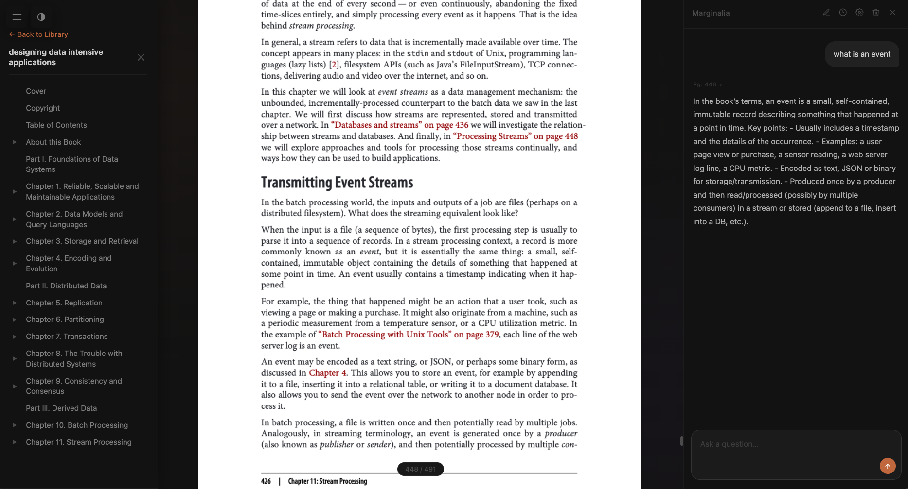

# Marginalia



A self-hosted book reader with a built-in LLM chat sidebar. Read EPUB, PDF, MOBI, and DOCX files — highlight a passage, ask a question, get an answer grounded in the text.

This project was vibe coded to explore reading books alongside an LLM. Inspired by [Karpathy's post](https://x.com/karpathy/status/1990577951671509438). Code is ephemeral — ask your LLM to change it however you like.

## Features

- **Multi-format support** — EPUB, PDF, MOBI, DOCX
- **Continuous scroll** — all chapters on one page, TOC navigates instantly
- **PDF.js rendering** — correct fonts, fully selectable and copyable text
- **LLM chat sidebar** — any LangChain-supported provider; each message is grounded in the current chapter
- **Text selection context** — highlight a passage, it appears as a quote chip in the chat input and is injected into the LLM prompt
- **Three-panel layout** — TOC sidebar + reading area + chat panel, all resizable
- **Dark mode** — smooth toggle, persists across sessions
- **Liquid glass UI** — backdrop-blur panels, gradient library covers
- **Keyboard shortcuts** — `Cmd/Ctrl+B` TOC, `Cmd/Ctrl+/` chat, `Shift+Enter` to break line in chat, `ESC` to dismiss

## Setup

The project uses [uv](https://docs.astral.sh/uv/).

### macOS app (recommended)

Build and install Marginalia as a native macOS app:

```bash
./build-app.sh
```

**Requirements:** Xcode Command Line Tools (`xcode-select --install`), [uv](https://docs.astral.sh/uv/), and Pillow (`pip3 install Pillow`).

This installs **Marginalia.app** to `/Applications`. Double-click to launch — it starts the server and opens your browser automatically. Quitting the app (Cmd+Q or closing the browser tab) stops the server and cleans up.

The build script auto-detects the project directory and `uv` location — no configuration needed. If you move the project folder, just re-run `./build-app.sh` from the new location.

### Manual

```bash
uv run server.py
```

Visit [localhost:8123](http://localhost:8123/) to open the library. Upload books directly from the browser (drag-and-drop or file picker).

To pre-register a book from the command line:

```bash
uv run marginalia.py dracula.epub
```

## LLM Chat

The chat sidebar is a reading companion that knows exactly what you're reading. Every message is grounded in two layers of book context automatically — no copy-pasting required.

### How context works

**Current chapter text**

When you send a message, the server injects up to 8,000 characters of the chapter you're currently viewing into the system prompt as full plain text, not a summary. The model sees the same words you're reading. You can ask things like:

- *"What is the author arguing in this section?"*
- *"Explain stream processing in simpler terms."*
- *"What does this paragraph imply about the character's motivation?"*

The chapter context updates automatically as you scroll to a new chapter — the next message you send will carry that chapter's text instead.

**Highlighted passage**

Select any text in the reading area and a quote chip appears above the chat input. When you send, the highlighted excerpt is prepended to your message as `[Highlighted passage: "..."]` — so you can point the model at a specific sentence even within a long chapter. The quote is saved in the conversation history, so the reference stays intact when you reopen the conversation later.

**Conversation history**

The last 10 messages of each conversation are included in every request, so the model remembers what you've already discussed. Conversations are stored per book under `library/<book>/chat_data/` and persist across sessions. You can keep multiple conversations per book (useful for tracking separate threads or questions) and clear or switch between them from the chat header.

**Streaming**

Responses stream token by token via SSE so you see the answer as it arrives, with no waiting for the full response to complete.

### Provider setup

The chat works with any [LangChain-supported provider](https://python.langchain.com/docs/integrations/chat/). Open the settings panel (gear icon in the chat header) and fill in:

| Field | Notes |
|---|---|
| Provider | `openai`, `azure_openai`, `anthropic`, `ollama`, `groq`, `mistralai`, `google_genai`, and many more |
| Model | Model name or Azure deployment name (e.g. `gpt-4o`, `claude-opus-4-5`, `llama3.2`) |
| API Key | Leave blank for local providers (Ollama) or IAM-authenticated providers (Bedrock, Vertex AI) |
| Endpoint | Required for Azure OpenAI; optional custom base URL for self-hosted models |
| API Version | Azure only — defaults to `2024-02-15-preview` |

Credentials are stored in `config.json` at the project root (gitignored).

## License

MIT
